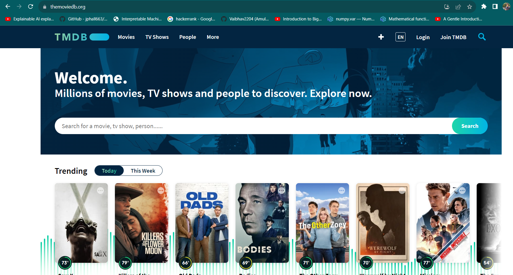
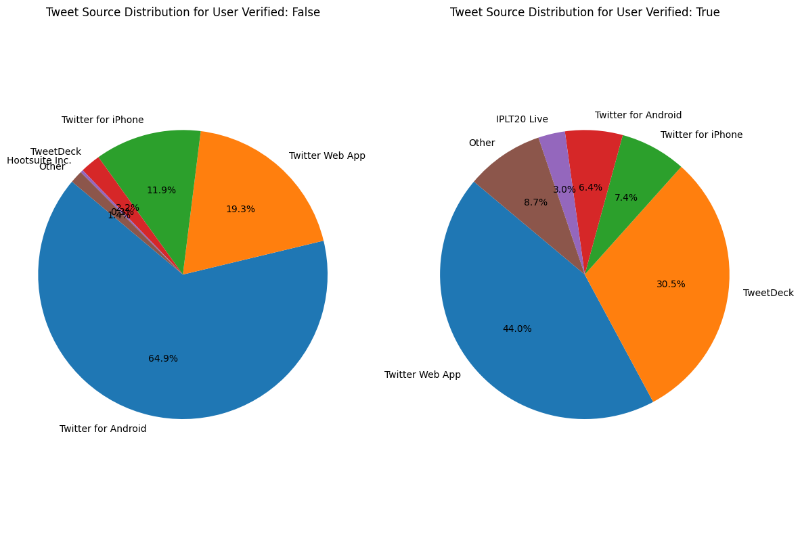
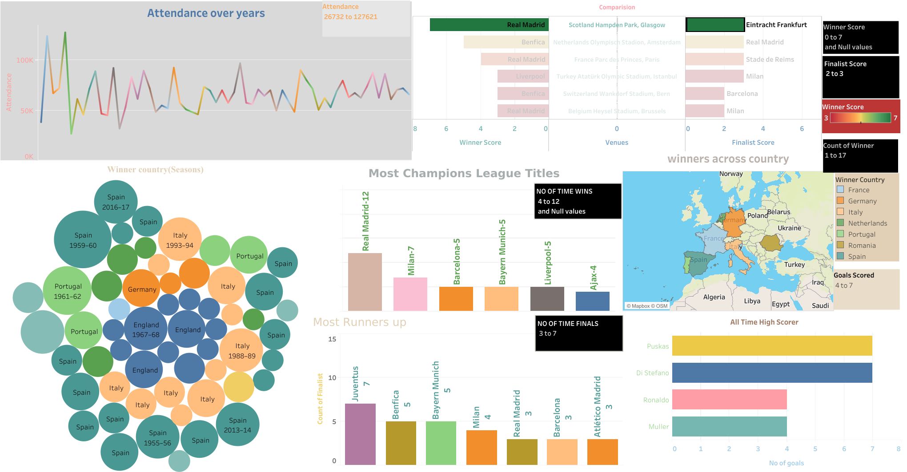

# Data Science Portfolio
Basic data science portfolio

## [Project 1:TMBD Movie & Series Web Scrapping using Python](https://github.com/Vaibhav2204/Webscrapping)

#### Overview
- Scraped Movies/Series from TMBD website using Requests & BeautifulSoup4.
- Implemented functions such as `get_topic_page()`, `Ratings()`, `movie_url()` to extract relevant information.
- Stored data with 100+ rows x 5 columns into Movies.csv.
 

## [Project 2:Exploratory Data Analysis on IPL 2020 Tweets](https://github.com/Vaibhav2204/EDA_project)

#### Overview
- Cleaned & analyzed data with over 5.5M rows and 15 columns using Pandas.
- Created visualizations (scatter plots, WordCloud, PairPlot, etc.) using Seaborn, Matplotlib & Plotly.
- Discovered that most tweets are from Mumbai, India during IPL 2020 season.
.png)

## [Project 3:UEFA Champions League Insights](https://github.com/Vaibhav2204/Tableau)

#### Overview
- Analyzed a dataset of different teams with various players using Pivot Tables, VLOOKUP in Excel and Google Sheets.
- Loaded the dataset into Tableau and created a dashboard with maps, bar plots, packed bubbles, etc.
- Discovered that Real Madrid has the highest number of Champions League Titles & Goals.

## [Project 4: Walmart Sales Forecasting using Machine Learning](https://github.com/Vaibhav2204/Ml_project)

#### Overview
- Cleaned & analyzed a retail store dataset with 420,000+ rows & 16 columns to predict weekly sales.
- Trained linear models, random forests, and gradient boosted trees using scikit-learn & XGBoost.
- Achieved a weighted mean absolute error of $2,487, landing in the top 25% on Kaggle.
.png)
.png)

## Repository Structure

- `TMBD_Scraper/`: Contains code and data for the TMBD Movie & Series Scraper.
- `IPL_Tweets_EDA/`: Contains Jupyter notebook and data for the IPL 2020 Tweets EDA.
- `UEFA_Champions_League_Insights/`: Holds Excel and Tableau files for the Champions League Insights.
- `Walmart_Sales_Forecasting/`: Includes notebooks and data for the Walmart Sales Forecasting.

## How to Use

- Detailed instructions for running each project can be found in their respective directories.

## Technologies Used

- Python (Requests, BeautifulSoup4, Pandas, Seaborn, Matplotlib, Plotly, scikit-learn, XGBoost)
- Excel, Google Sheets
- Tableau
